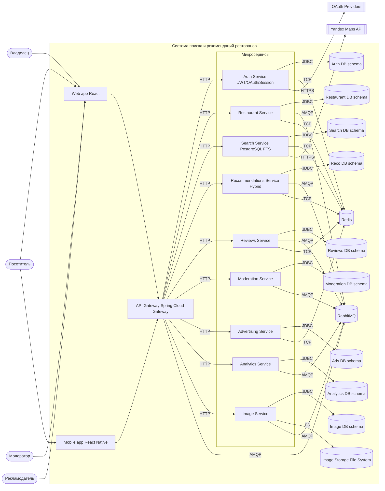

# Container diagram (C4-like): Система поиска и рекомендаций ресторанов

> Примечания:
>
> - Sync вызовы: HTTP через API Gateway
> - Events: AMQP (RabbitMQ)
> - Cache/Sessions: Redis (TCP)
> - Images: File Storage (FS)

