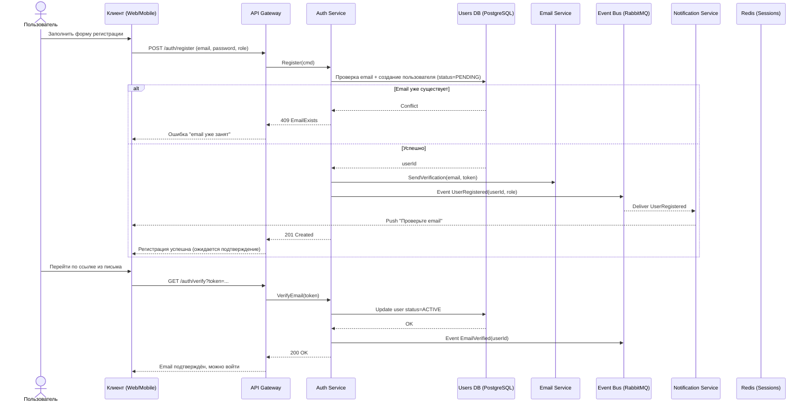
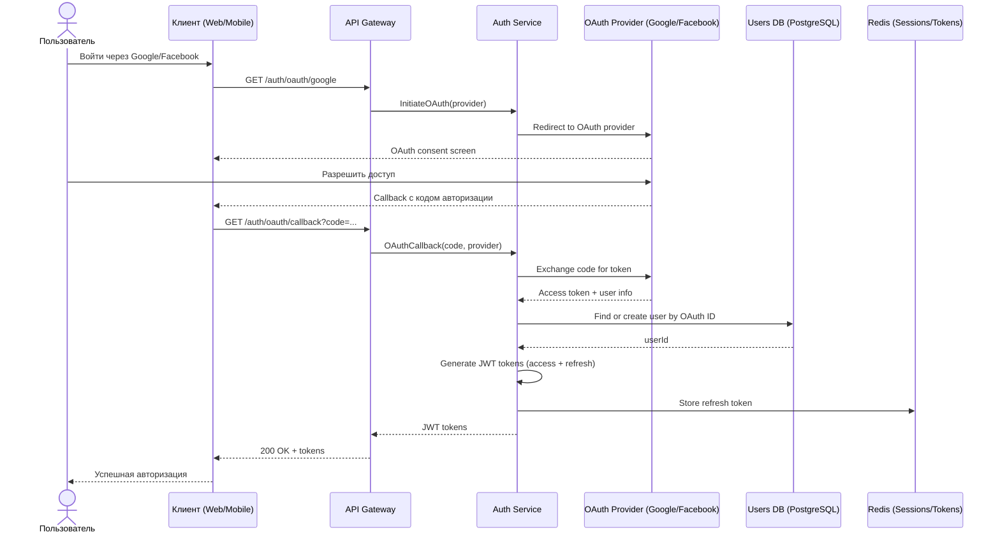
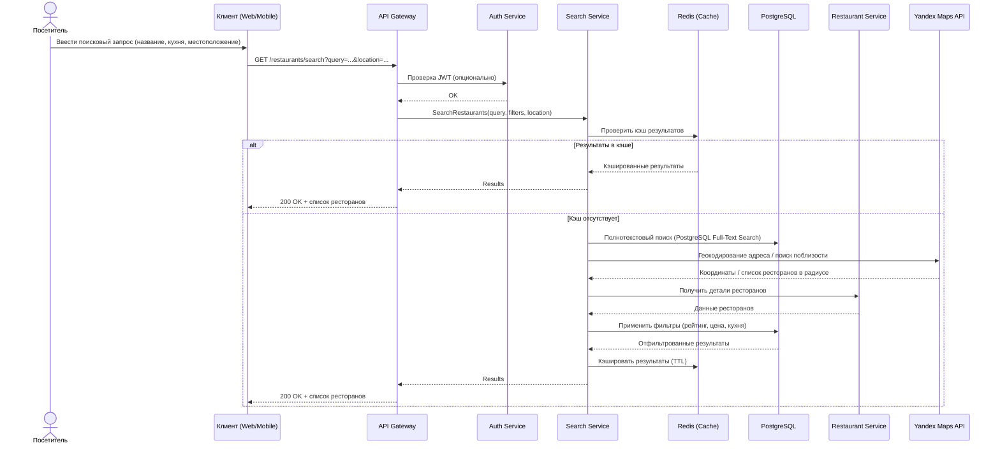
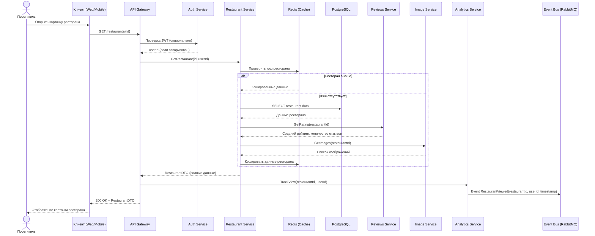
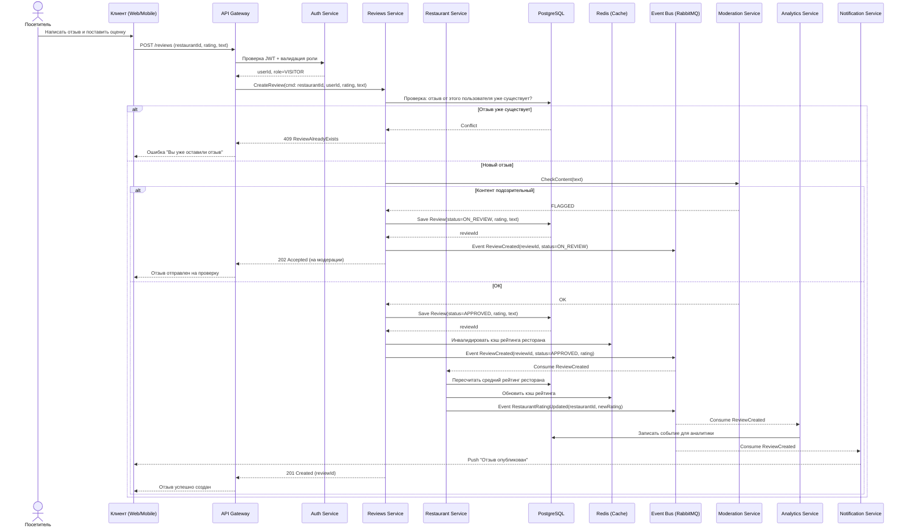
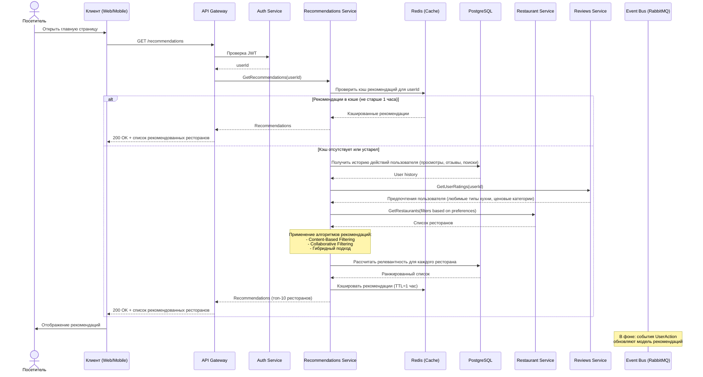
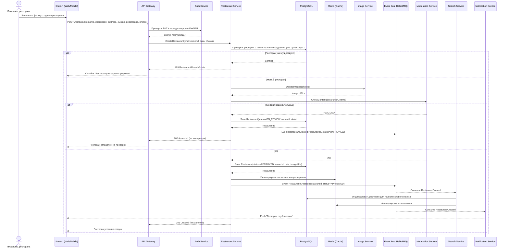
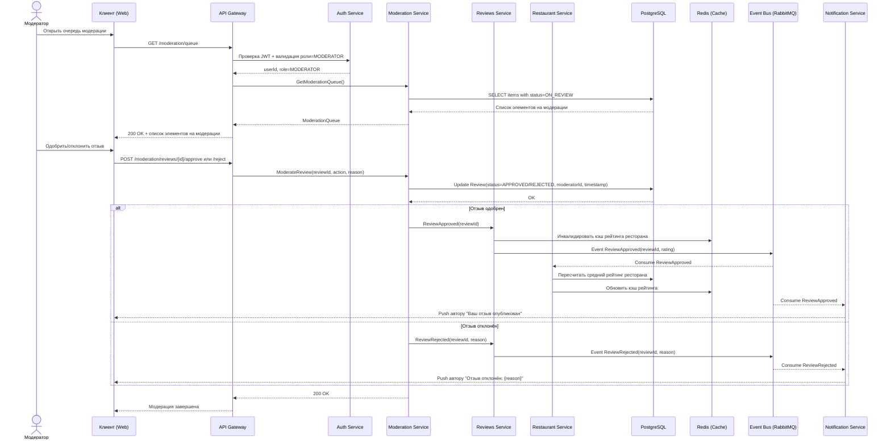
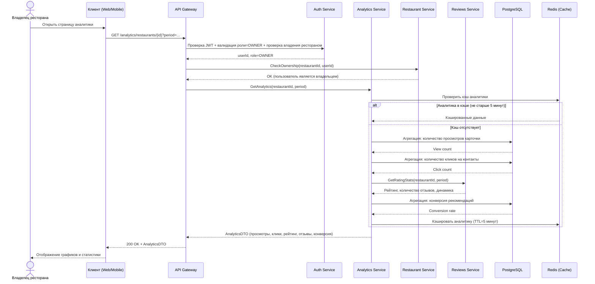
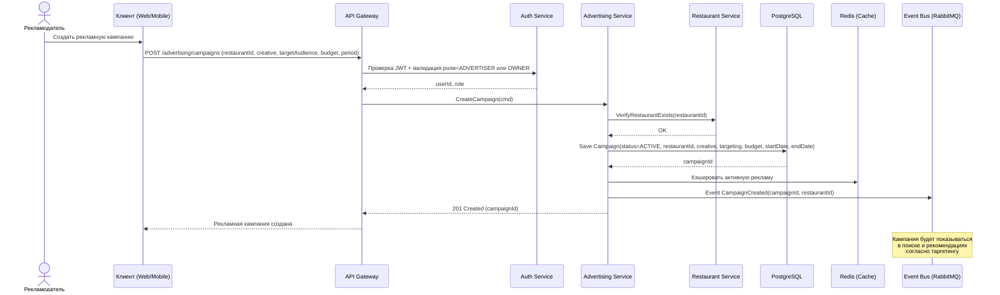

# Диаграммы последовательности системы поиска и рекомендаций ресторанов

## 1) Регистрация пользователя

## 2) Аутентификация через OAuth

## 3) Поиск ресторанов

## 4) Просмотр карточки ресторана

## 5) Создание отзыва и оценки

## 6) Получение персонализированных рекомендаций

## 7) Создание ресторана владельцем

## 8) Модерация отзыва модератором

## 9) Просмотр аналитики владельцем ресторана

## 10) Создание рекламной кампании

