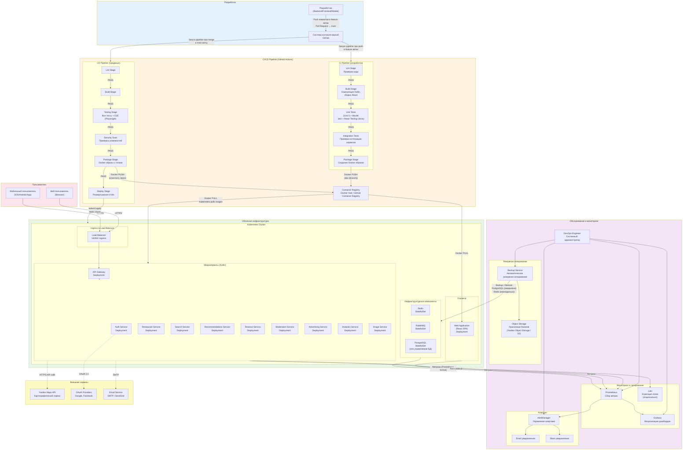

# CI/CD и развертывание системы

## Теоретическая часть

### Что такое CI/CD?

**CI (Continuous Integration - Непрерывная интеграция)** — практика разработки, при которой разработчики часто (несколько раз в день) сливают изменения кода в общий репозиторий. Каждое слияние запускает автоматизированные сборку и тесты, чтобы быстро выявлять ошибки интеграции.

**CD (Continuous Deployment/Delivery - Непрерывное развертывание/доставка)** — автоматизация процесса развертывания приложения:
- **Continuous Delivery** — код автоматически проходит тесты и готов к развертыванию, но релиз выполняется вручную
- **Continuous Deployment** — код автоматически развертывается в продакшн после прохождения всех тестов

### Преимущества CI/CD

1. **Раннее обнаружение ошибок** — баги выявляются сразу после коммита
2. **Быстрая обратная связь** — разработчики узнают о проблемах за минуты, а не дни
3. **Автоматизация** — исключаются ручные ошибки при сборке и развертывании
4. **Более частые релизы** — новые функции доставляются пользователям быстрее
5. **Откат изменений** — легкий возврат к предыдущей версии при проблемах

### Основные компоненты CI/CD pipeline

1. **Source Control** — система контроля версий (Git, GitHub)
2. **Build Stage** — компиляция и сборка приложения
3. **Test Stage** — автоматическое тестирование (unit, integration, e2e)
4. **Package Stage** — создание артефактов (Docker образы, пакеты)
5. **Deploy Stage** — развертывание в различные окружения (dev, staging, prod)
6. **Monitoring** — мониторинг состояния приложения после развертывания

### Стратегии развертывания

- **Blue-Green Deployment** — два идентичных окружения, переключение трафика между ними
- **Rolling Deployment** — постепенное обновление инстансов без простоя
- **Canary Release** — развертывание новой версии небольшой части пользователей
- **A/B Testing** — тестирование разных версий на разных группах пользователей

## Диаграмма CI/CD и развертывания

## Описание процесса развертывания

### 1. Разработка (Development)

**Процесс:**
- Разработчики создают feature-ветки от основной ветки `main`
- Изменения коммитятся в feature-ветки
- Создается Pull Request для слияния с `main`
- Code Review другими членами команды

**Технологии:**
- **GitHub** — система контроля версий
- **GitHub Flow** — упрощенная модель ветвления

### 2. CI Pipeline (Continuous Integration)

**Запуск:** Автоматически при каждом push в feature-ветку

**Этапы:**
1. **Lint Stage** — проверка качества кода (ktlint для Kotlin, ESLint для React)
2. **Build Stage** — компиляция:
   - Kotlin → JAR файлы через Gradle
   - React → оптимизированный production build
3. **Unit Tests** — быстрые тесты отдельных компонентов:
   - Backend: JUnit 5 + MockK
   - Frontend: Jest + React Testing Library
4. **Integration Tests** — тесты взаимодействия сервисов
5. **Package Stage** — создание Docker образов:
   - Каждый микросервис упаковывается в отдельный образ
   - Frontend упаковывается в Nginx образ

**Артефакты:** Docker образы с тегами `dev-{branch-name}` публикуются в Container Registry

### 3. CD Pipeline (Continuous Deployment)

**Запуск:** Автоматически при merge в `main` ветку (только после успешного Code Review)

**Этапы:**
1. **Все этапы CI** (Lint, Build, Tests)
2. **Security Scan** — проверка Docker образов на уязвимости (Trivy, Snyk)
3. **Package Stage** — создание production образов с версионными тегами
4. **Deploy Stage** — автоматическое развертывание:
   - Обновление Kubernetes манифестов
   - Постепенное развертывание (Rolling Update)
   - Проверка health checks

**Стратегия развертывания:** Rolling Deployment для минимизации простоя

### 4. Развертывание (Deployment)

**Инфраструктура:**
- **Kubernetes** — оркестрация контейнеров
- **Deployments** — для stateless сервисов (все микросервисы)
- **StatefulSets** — для stateful сервисов (PostgreSQL, Redis, RabbitMQ)
- **Services** — для внутренней маршрутизации
- **Ingress** — для внешнего доступа

**Компоненты:**
- **API Gateway** — точка входа, маршрутизация запросов
- **Микросервисы** — независимые сервисы (Auth, Restaurant, Search, и т.д.)
- **Frontend** — React SPA, раздаётся через Nginx
- **Инфраструктура** — PostgreSQL, Redis, RabbitMQ

### 5. Мониторинг (Monitoring)

**Метрики:**
- **Prometheus** — сбор метрик от всех сервисов
- **Grafana** — визуализация метрик и создание дашбордов

**Метрики для отслеживания:**
- Производительность (response time, throughput)
- Доступность (uptime, error rate)
- Ресурсы (CPU, Memory, Disk)
- Бизнес-метрики (количество поисков, отзывов, пользователей)

**Логирование:**
- Логи собираются из всех сервисов
- Централизованное хранение (опционально Loki + Grafana)

### 6. Резервное копирование (Backup)

**Стратегия:**
- **PostgreSQL** — ежедневное полное резервное копирование + WAL архивирование
- **Redis** — еженедельные снапшоты
- **Файловое хранилище** (изображения) — репликация в Object Storage

**Хранение:**
- Бэкапы сохраняются в Object Storage (Yandex Object Storage / AWS S3)
- Retention policy: 30 дней ежедневных, 12 месяцев ежемесячных

**Восстановление:**
- RTO (Recovery Time Objective) — 15 минут
- RPO (Recovery Point Objective) — 5 минут

### 7. Алертинг (Alerting)

**Система:** AlertManager (часть Prometheus)

**Триггеры алертов:**
- Высокий уровень ошибок (> 5% за 5 минут)
- Низкая доступность сервиса (< 99%)
- Высокая загрузка ресурсов (CPU > 80%, Memory > 85%)
- Недоступность внешних сервисов (Yandex Maps API)
- Проблемы с базой данных

**Каналы уведомлений:**
- Email — критические алерты
- Slack — все алерты для команды

## Особенности развертывания микросервисов

### Независимое развертывание

Каждый микросервис развертывается независимо:
- Отдельный Docker образ
- Отдельный Deployment в Kubernetes
- Возможность обновления одного сервиса без влияния на другие

### Версионирование

- Семантическое версионирование (SemVer): `v1.2.3`
- Docker теги: `restaurant-service:v1.2.3`, `restaurant-service:latest`
- Версии API для обратной совместимости

### Health Checks

Каждый сервис предоставляет эндпоинты для проверки здоровья:
- `/health` — базовая проверка
- `/health/readiness` — готовность принимать трафик
- `/health/liveness` — сервис работает

Kubernetes использует эти эндпоинты для:
- Автоматического перезапуска неработающих подов
- Маршрутизации трафика только к готовым сервисам

### Масштабирование

- **Горизонтальное масштабирование** через изменение количества реплик в Kubernetes
- **Автомасштабирование** (HPA) на основе CPU/Memory или кастомных метрик
- **Отдельное масштабирование** каждого сервиса в зависимости от нагрузки

### Конфигурация

- **ConfigMaps** — для некритичной конфигурации
- **Secrets** — для чувствительных данных (пароли, API ключи)
- **Environment Variables** — для переменных окружения

## Роли и ответственность

### Разработчик (Developer)
- Написание кода и тестов
- Создание Pull Request
- Проведение Code Review

### DevOps Engineer
- Настройка и поддержка CI/CD pipelines
- Управление инфраструктурой Kubernetes
- Мониторинг и алертинг
- Резервное копирование и восстановление

### QA Engineer
- Написание E2E тестов
- Тестирование в staging окружении
- Проверка качества релизов

## Окружения (Environments)

1. **Development** — локальная разработка, Docker Compose
2. **CI** — автоматическое тестирование в pipeline
3. **Staging** — предпродакшн окружение для финального тестирования
4. **Production** — боевое окружение для пользователей

Каждое окружение имеет свою конфигурацию и уровень доступа.

