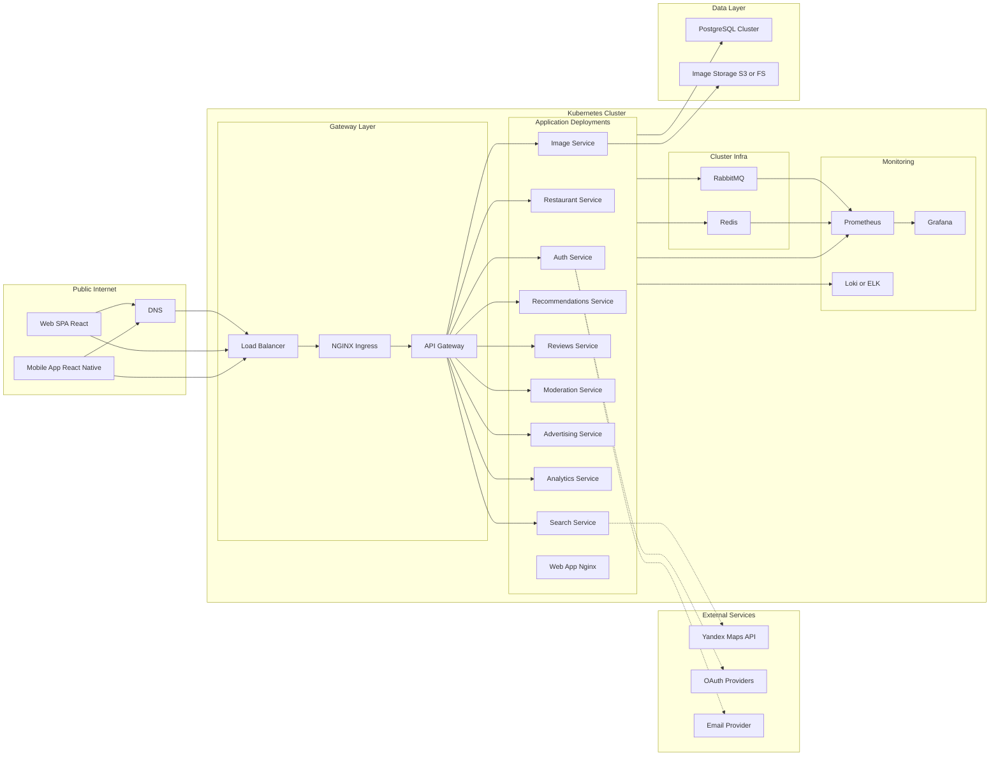

## Infrastructure / Deployment Diagram — Система поиска и рекомендаций ресторанов

### Пояснение к диаграммам Infrastructure / Deployment и Maintenance / Deployment

#### Infrastructure / Deployment — развертывание

Диаграмма показывает, **где и как физически развернута система** и как проходит пользовательский трафик.  
Пользователи работают через **Web SPA (React)** и **Mobile App (React Native)**. Запросы идут по HTTPS через **DNS → Load Balancer → NGINX Ingress**, затем попадают в **API Gateway**, который выполняет маршрутизацию запросов, проверку авторизации и ограничения (rate limiting).

Внутри Kubernetes развернуты микросервисы:

- Auth, Restaurant, Search, Recommendations, Reviews, Moderation, Advertising, Analytics, Image,
  а также компонент раздачи фронтенда (**Web App Nginx**).

Сервисы используют инфраструктурные компоненты кластера:

- **RabbitMQ** — обмен событиями и асинхронные задачи (event-driven взаимодействие),
- **Redis** — кэш и хранение сессионных данных (refresh tokens / sessions / быстрые кеши).

Хранение данных представлено отдельным слоем:

- **PostgreSQL Cluster** — основной datastore системы,
- **Image Storage (S3/FS)** — файловое хранилище изображений.

> Важно про БД “для каждого сервиса”: логически каждый сервис владеет своим набором данных (например, отдельные схемы/таблицы/учетные записи доступа — _schema-per-service_). Физически в учебном проекте эти данные могут располагаться в одном кластере PostgreSQL, чтобы не усложнять инфраструктуру. При необходимости это может быть расширено до _database-per-service_ (отдельные БД/инстансы).

Внешние интеграции:

- **Search Service** обращается к **Yandex Maps API** (геокодирование/поиск поблизости),
- **Auth Service** использует **OAuth Providers** (социальная авторизация) и **Email Provider** (верификация email/уведомления).

Наблюдаемость:

- **Prometheus** собирает метрики с приложений и инфраструктуры (через exporter’ы для Redis/RabbitMQ),
- **Grafana** визуализирует метрики,
- **Loki/ELK** агрегирует логи сервисов (как централизованное логирование).

Диаграмма агрегирует часть связей (например, “все сервисы → PostgreSQL/Redis/RabbitMQ”), чтобы избежать перегруженности стрелками. Детальные сервис-к-сервису взаимодействия (конкретные сценарии) обычно показываются на sequence/компонентных диаграммах.
