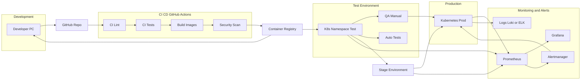

## Maintenance / Deployment Diagram — обслуживание (CI/CD → test → stage → prod + monitoring + rollback)

#### Maintenance / Deployment — обслуживание

Диаграмма обслуживания показывает **жизненный цикл изменений**: от коммита разработчика до обновления production, а также мониторинг и откаты.

1. **Разработка**

- Разработчик делает изменения локально и отправляет их в **GitHub** (push + Pull Request).
- В PR выполняется code review.

2. **CI/CD (GitHub Actions)**
   После push/merge запускаются workflow:

- **Lint** (проверка стиля и статический анализ),
- **Tests** (unit/integration, при наличии — e2e),
- **Build Images** (сборка Docker-образов сервисов),
- **Security Scan** (проверка уязвимостей образов/зависимостей).

Артефакты публикуются в **Container Registry**. Рекомендуемая практика — тегировать образы как минимум:

- `service:sha-<commit>` (точная воспроизводимость),
- `service:vX.Y.Z` (релизные теги),
  а `latest` использовать только как удобный алиас.

3. **Окружения (Test → Stage → Prod)**

- **Test**: развертывание в тестовый namespace, прогон smoke/regression, ручная проверка QA.
- **Stage**: финальная проверка конфигураций и интеграций, приближено к production.
- **Prod**: развертывание в production Kubernetes.

Стратегия выката на production — **Rolling Update**: новые pod’ы поднимаются постепенно, затем старые выключаются. Это позволяет обновляться без простоя при корректно настроенных readiness/liveness probes.
