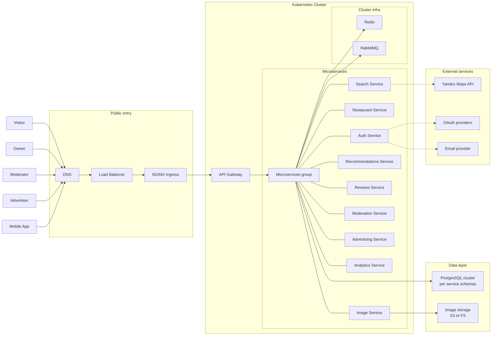

```mermaid

flowchart LR

%% Users
Visitor["Visitor"]
Owner["Owner"]
Moderator["Moderator"]
Advertiser["Advertiser"]
Mobile["Mobile App"]

%% Public entry
subgraph EDGE["Public entry"]
DNS["DNS"]
LB["Load Balancer"]
Ingress["NGINX Ingress"]
end

%% Kubernetes
subgraph K8S["Kubernetes Cluster"]
APIGW["API Gateway"]

subgraph SVC["Microservices"]
SVCALL["Microservices group"]
Auth["Auth Service"]
Rest["Restaurant Service"]
Search["Search Service"]
Reco["Recommendations Service"]
Reviews["Reviews Service"]
Mod["Moderation Service"]
Ads["Advertising Service"]
Anal["Analytics Service"]
Img["Image Service"]

    %% visual grouping, no heavy arrows
    SVCALL --- Auth
    SVCALL --- Rest
    SVCALL --- Search
    SVCALL --- Reco
    SVCALL --- Reviews
    SVCALL --- Mod
    SVCALL --- Ads
    SVCALL --- Anal
    SVCALL --- Img

end

subgraph INFRA["Cluster infra"]
Redis["Redis"]
Rabbit["RabbitMQ"]
end
end

%% Data
subgraph DATA["Data layer"]
Pg["PostgreSQL cluster<br/>per service schemas"]
ImgStore["Image storage<br/>S3 or FS"]
end

%% External
subgraph EXT["External services"]
Maps["Yandex Maps API"]
OAuth["OAuth providers"]
Mail["Email provider"]
end

%% Flows
Visitor --> DNS
Owner --> DNS
Moderator --> DNS
Advertiser --> DNS
Mobile --> DNS

DNS --> LB
LB --> Ingress
Ingress --> APIGW

APIGW --> SVCALL

SVCALL --> Pg
SVCALL --> Redis
SVCALL --> Rabbit
Img --> ImgStore

Search -.-> Maps
Auth -.-> OAuth
Auth -.-> Mail
```
