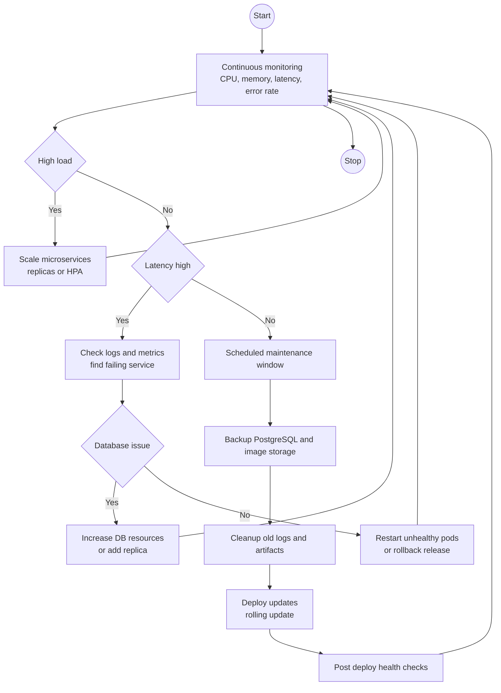

```mermaid

flowchart TB

Start((Start)) --> Monitor["Continuous monitoring<br/>CPU, memory, latency, error rate"]

Monitor --> HighLoad{"High load"}
HighLoad -- Yes --> ScaleSvc["Scale microservices<br/>replicas or HPA"]
ScaleSvc --> Monitor

HighLoad -- No --> HighLatency{"Latency high"}
HighLatency -- Yes --> CheckLogs["Check logs and metrics<br/>find failing service"]
CheckLogs --> DbIssue{"Database issue"}
DbIssue -- Yes --> TuneDb["Increase DB resources<br/>or add replica"]
TuneDb --> Monitor
DbIssue -- No --> RestartSvc["Restart unhealthy pods<br/>or rollback release"]
RestartSvc --> Monitor

HighLatency -- No --> Nightly["Scheduled maintenance window"]

Nightly --> Backup["Backup PostgreSQL and image storage"]
Backup --> Cleanup["Cleanup old logs and artifacts"]
Cleanup --> Deploy["Deploy updates<br/>rolling update"]
Deploy --> Health["Post deploy health checks"]
Health --> Monitor

Monitor --> Stop((Stop))
```
